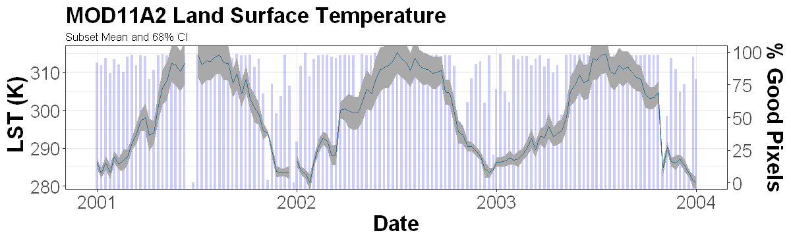

# Access the MODIS web service and perform quality filtering using R

*Author: ORNL DAAC*  
*Date: February 27, 2018*  
*Contact for ORNL DAAC: uso@daac.ornl.gov*  

### Keywords: MODIS, web service, R, REST

## Overview

The tutorial outlined in the [jupyter notebook](modis_restservice_qc_filter_R.ipynb) will explore using the R to access MODIS Land Products through the new (May 2018) REST-based web service hosted by the ORNL DAAC. For a full description and usage examples of the web service, please visit the ORNL DAAC's MODIS microsite: https://modis.ornl.gov/data/modis_webservice.html

Using the MODIS Web Service users can:

* Retrieve MODIS subsets through command line operations
* Download and integrate subsets directly into client-side workflows
* Download and visualize subsets with customized code 
* ... and much more.

This tutorial will demonstrate how to do the following in R:

* **dates** and **subset** request examples
* build a time series of MOD11A2 land surface temperature from multiple web service subset requests
* perform quality control filtering based on multiple MODIS qc criteria

[The same instructions are provided in Python in another repository.](https://github.com/ornldaac/modis_restservice_qc_filter_Python)

## Source Data

Input data were accessed through the [MODIS Web Service](https://modis.ornl.gov/data/modis_webservice.html) hosted at the ORNL DAAC. All necessary steps for accessing the web service using R are outlined in the [jupyter notebook](modis_restservice_qc_filter_R.ipynb).

Other methods for accessing data through the web service are described at the MODIS web page; https://modis.ornl.gov. 

## Prerequisites: 

R (3.x recommended). R libraries: httr, readr, jsonlite, ggplot2, scales  
*Note: Not all libraries required. readr enables conversation of text response into data.frame; jsonlite enables conversion of json response.*

## Procedure

Access the the tutorial here:  
[Tutorial](modis_restservice_qc_filter_R.ipynb)
